# CLI 架构与调用图分析

> 本文档分析 wp-cli-core, wp-cli-utils, wp-config 三个核心 crate 的架构设计与调用关系

## 目录

- [1. 整体架构概览](#1-整体架构概览)
- [2. Crate 依赖关系](#2-crate-依赖关系)
- [3. 模块职责划分](#3-模块职责划分)
- [4. 关键调用流程](#4-关键调用流程)
- [5. 数据流分析](#5-数据流分析)
- [6. 接口清单](#6-接口清单)

---

## 1. 整体架构概览

### 1.1 三层架构设计

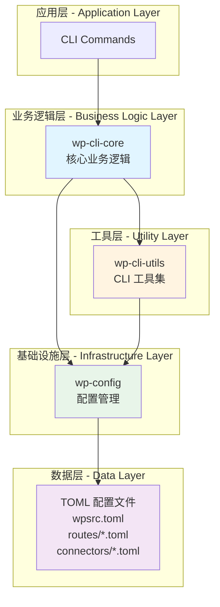

### 1.2 设计原则

- **单向依赖**: 上层依赖下层，避免循环依赖
- **职责分离**: 每个 crate 职责明确，耦合度低
- **配置驱动**: 所有业务逻辑基于配置文件
- **可测试性**: 模块化设计便于单元测试

---

## 2. Crate 依赖关系

### 2.1 包依赖图

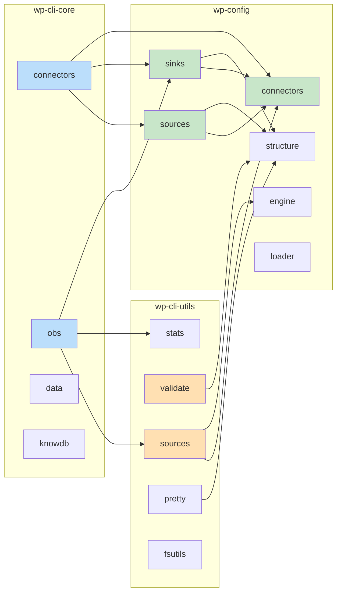

### 2.2 Cargo 依赖声明

| Crate | 依赖项 | 用途 |
|-------|--------|------|
| **wp-cli-core** | `wpcnt_lib` (wp-cli-utils) | 使用统计、验证工具 |
| **wp-cli-core** | `wp-conf` (wp-config) | 加载配置、构建实例 |
| **wp-cli-utils** | `wp_conf` (wp-config) | 读取配置结构、参数处理 |
| **wp-config** | - | 无内部依赖（基础设施层） |

---

## 3. 模块职责划分

### 3.1 wp-config (wp_conf) - 配置管理核心

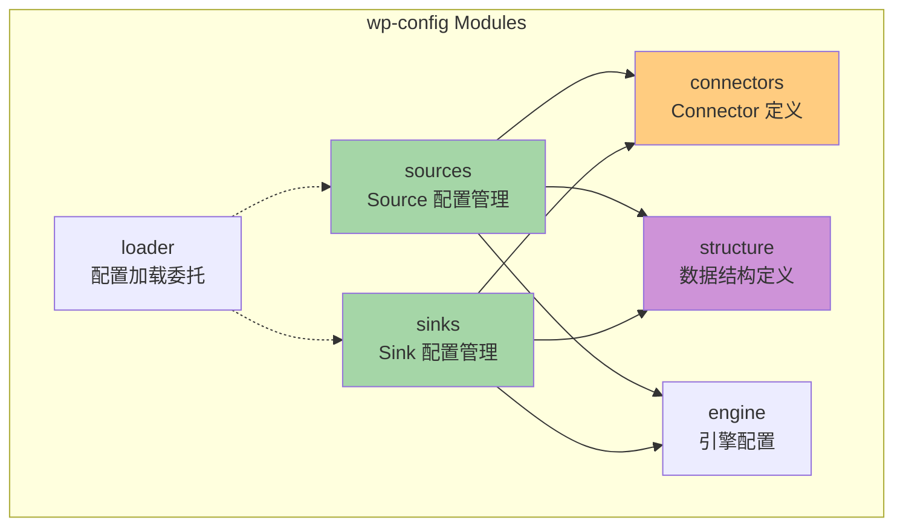

**核心职责**:
- 加载和解析 TOML 配置文件
- 定义 Source/Sink Connector 接口
- 验证配置完整性和一致性
- 提供配置结构体定义
- 管理参数合并和覆盖逻辑

**关键类型**:
- `EngineConfig`: 引擎配置（src_root, sink_root 等）
- `SourceConnector`: Source connector 定义
- `SinkConnector` (ConnectorRec): Sink connector 定义
- `WpSourcesConfig`: wpsrc.toml 配置结构
- `RouteFile`: Sink 路由文件结构
- `FlexGroup`: Sink 分组配置
- `SinkInstanceConf`: 解析后的 Sink 实例

### 3.2 wp-cli-utils (wpcnt_lib) - CLI 工具库

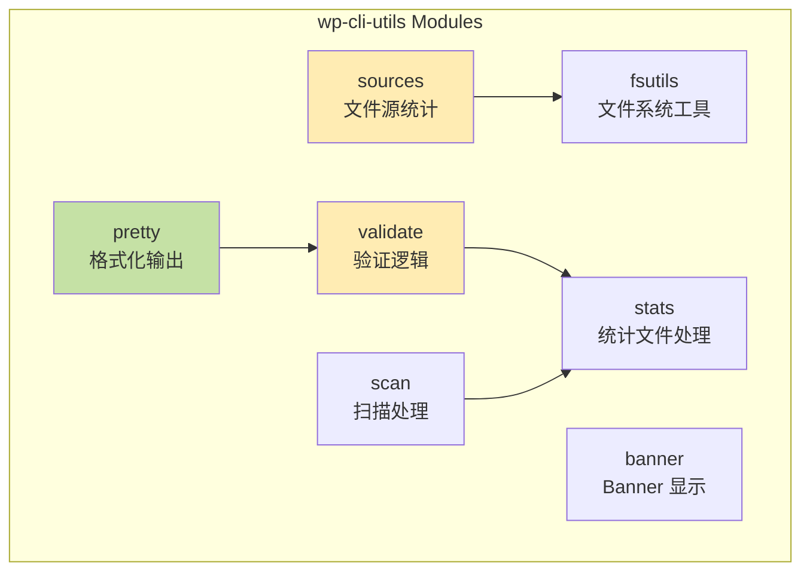

**核心职责**:
- 统计文件源行数
- 验证 Sink 输出比例
- 格式化表格和报告输出
- 文件路径解析和行数统计
- 分组数据处理

**关键函数**:
- `list_file_sources_with_lines()`: 列出文件源及行数
- `total_input_from_wpsrc()`: 统计输入总行数
- `validate_groups()`: 验证分组比例
- `load_stats_file()`: 加载统计文件
- `print_*()`: 系列格式化输出函数

### 3.3 wp-cli-core (wp_cli_core) - 业务逻辑层

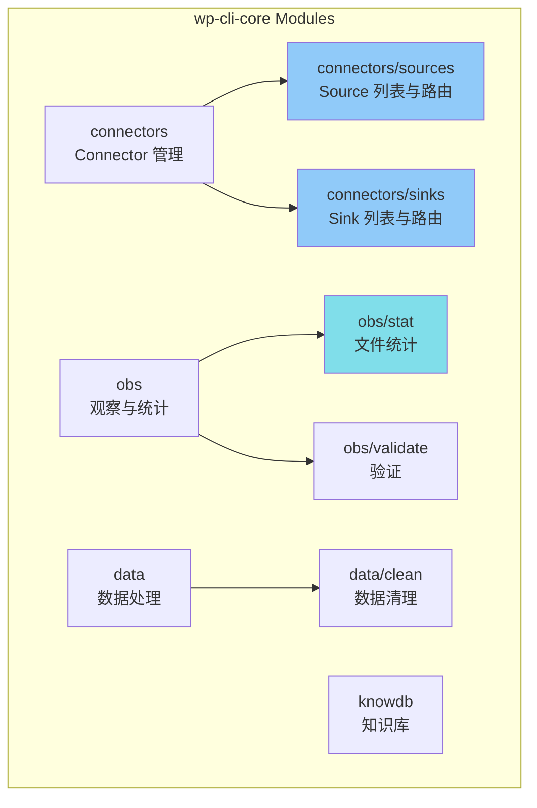

**核心职责**:
- 实现 CLI 命令的高层业务逻辑
- 生成 Connector 列表和路由表
- 执行文件统计和验证
- 数据清理和知识库管理

**关键函数**:
- `list_connectors()`: 列出 connectors 及使用次数
- `route_table()`: 生成路由表
- `validate_routes()`: 验证路由配置
- `stat_src_file()`: 统计 source 文件
- `stat_sink_file()`: 统计 sink 文件

---

## 4. 关键调用流程

### 4.1 Source 文件统计流程

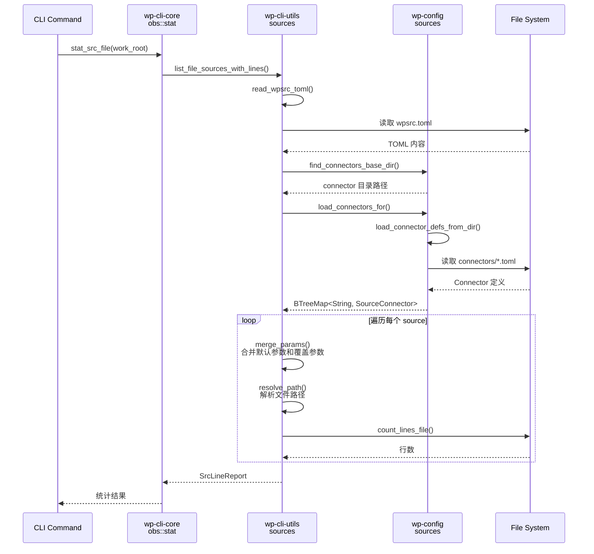

**调用链**:
1. `wp-cli-core::obs::stat::stat_src_file()`
2. → `wp-cli-utils::list_file_sources_with_lines()`
3. → `wp-config::find_connectors_base_dir()`
4. → `wp-config::sources::load_connectors_for()`
5. → `wp-cli-utils::fsutils::count_lines_file()`

### 4.2 Sink 路由表生成流程

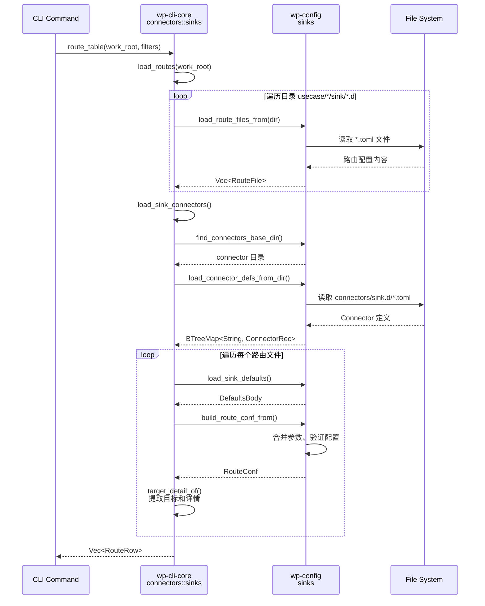

**调用链**:
1. `wp-cli-core::connectors::sinks::route_table()`
2. → `wp-cli-core::connectors::sinks::load_routes()`
3. → `wp-config::sinks::load_route_files_from()`
4. → `wp-config::sinks::io::find_connectors_base_dir()`
5. → `wp-config::connectors::load_connector_defs_from_dir()`
6. → `wp-config::sinks::build_route_conf_from()`

### 4.3 Source Connector 列表流程

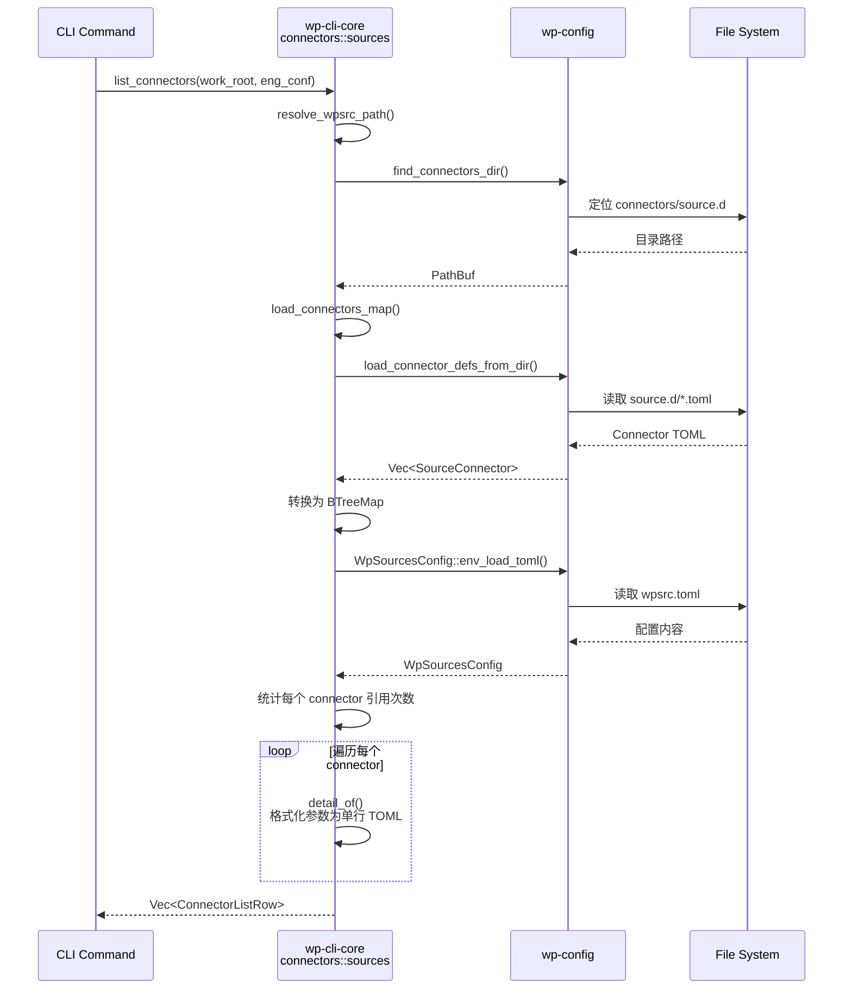

**调用链**:
1. `wp-cli-core::connectors::sources::list_connectors()`
2. → `wp-config::sources::find_connectors_dir()`
3. → `wp-config::connectors::load_connector_defs_from_dir()`
4. → `wp-config::sources::WpSourcesConfig::env_load_toml()`
5. → `wp-cli-core::connectors::sources::merge_params()`

### 4.4 路由验证流程

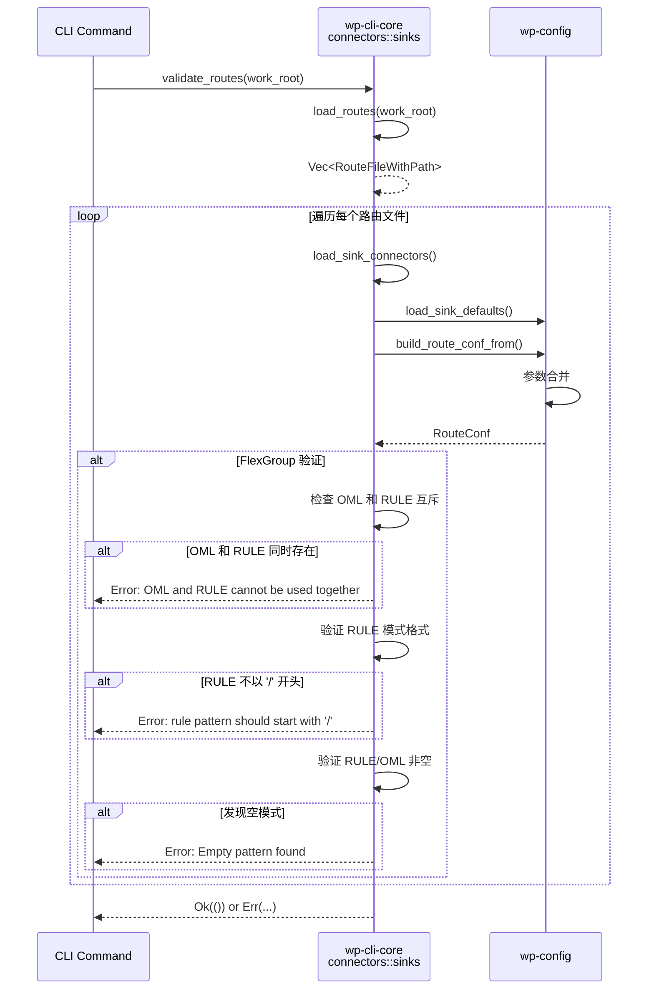

**调用链**:
1. `wp-cli-core::connectors::sinks::validate_routes()`
2. → `wp-config::sinks::build_route_conf_from()`
3. → 验证 FlexGroup 规则（OML/RULE 互斥、格式检查）

### 4.5 综合统计流程

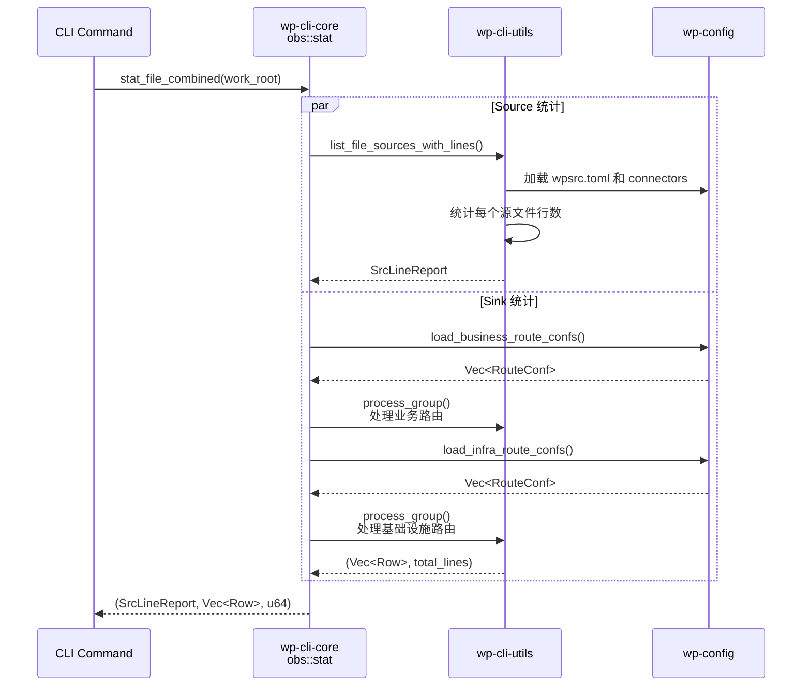

---

## 5. 数据流分析

### 5.1 配置数据流

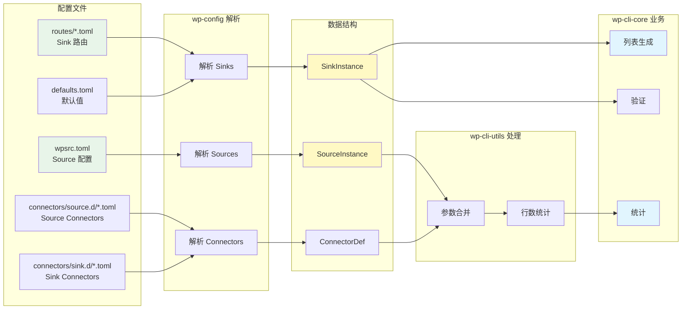

### 5.2 参数合并流程

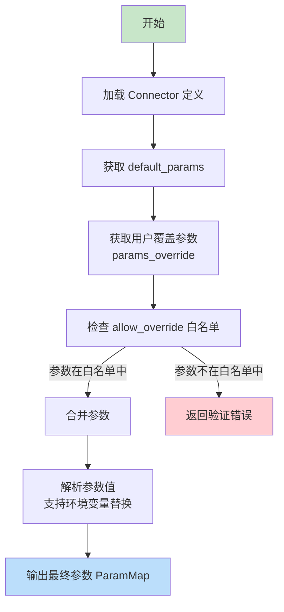

**参数优先级**: `用户覆盖 (params_override)` > `Connector 默认值 (default_params)`

### 5.3 文件定位策略

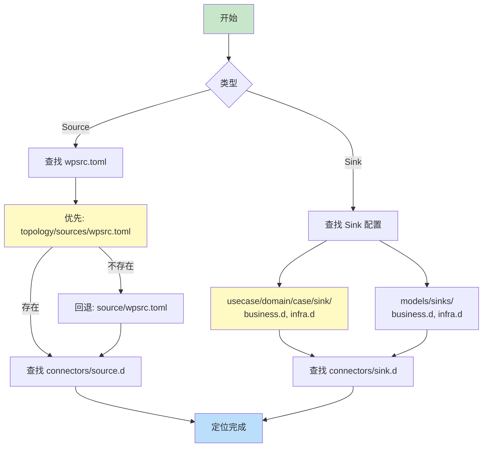

---

## 6. 接口清单

### 6.1 wp-config 公共接口

#### 6.1.1 Sources 模块

| 函数签名 | 功能 | 调用者 |
|---------|------|--------|
| `find_connectors_dir(path: &Path) -> Option<PathBuf>` | 定位 connectors/source.d 目录 | wp-cli-core, wp-cli-utils |
| `load_connectors_for(dir: &Path, env: &EnvDict) -> Result<BTreeMap<String, SourceConnector>>` | 加载 source connectors | wp-cli-utils |
| `WpSourcesConfig::env_load_toml(path: &Path, env: &EnvDict) -> Result<Self>` | 加载 wpsrc.toml | wp-cli-core |
| `build_source_instances(...) -> Result<Vec<SourceInstance>>` | 构建 source 实例 | - |

#### 6.1.2 Sinks 模块

| 函数签名 | 功能 | 调用者 |
|---------|------|--------|
| `load_route_files_from(dir: &Path, env: &EnvDict) -> Result<Vec<RouteFile>>` | 从目录加载路由文件 | wp-cli-core |
| `load_sink_defaults(sink_root: &str, env: &EnvDict) -> Result<Option<DefaultsBody>>` | 加载默认配置 | wp-cli-core |
| `build_route_conf_from(route: &RouteFile, defaults: Option<&DefaultsBody>, connectors: &BTreeMap) -> Result<RouteConf>` | 构建路由配置 | wp-cli-core |
| `load_business_route_confs(sink_root: &str, env: &EnvDict) -> Result<Vec<RouteConf>>` | 加载业务路由 | wp-cli-core |
| `load_infra_route_confs(sink_root: &str, env: &EnvDict) -> Result<Vec<RouteConf>>` | 加载基础设施路由 | wp-cli-core |
| `find_connectors_base_dir(path: &Path) -> Option<PathBuf>` | 定位 connectors/sink.d | wp-cli-core |

#### 6.1.3 Connectors 模块

| 函数签名 | 功能 | 调用者 |
|---------|------|--------|
| `load_connector_defs_from_dir(dir: &Path, scope: ConnectorScope, env: &EnvDict) -> Result<Vec<ConnectorDef>>` | 从目录加载 connector 定义 | wp-cli-core, wp-cli-utils |
| `param_value_from_toml(value: &toml::Value) -> ParamValue` | TOML 值转参数值 | wp-cli-utils |
| `param_map_to_table(params: &ParamMap) -> toml::Table` | 参数映射转 TOML 表 | wp-cli-core |

#### 6.1.4 Engine 模块

| 函数签名 | 功能 | 调用者 |
|---------|------|--------|
| `EngineConfig::init(work_root: &str) -> Self` | 初始化引擎配置 | wp-cli-core |
| `EngineConfig::src_root(&self) -> &str` | 获取 source 根目录 | wp-cli-core, wp-cli-utils |
| `EngineConfig::sink_root(&self) -> &str` | 获取 sink 根目录 | wp-cli-core |

### 6.2 wp-cli-utils 公共接口

#### 6.2.1 Sources 模块

| 函数签名 | 功能 | 调用者 |
|---------|------|--------|
| `list_file_sources_with_lines(work_root: &Path, eng: &EngineConfig, ctx: &Ctx) -> Option<SrcLineReport>` | 列出文件源及行数 | wp-cli-core |
| `total_input_from_wpsrc(work_root: &Path, eng: &EngineConfig, ctx: &Ctx) -> Option<u64>` | 统计总输入行数 | - |

#### 6.2.2 Validate 模块

| 函数签名 | 功能 | 调用者 |
|---------|------|--------|
| `validate_groups(groups: &[GroupAccum], total_override: Option<u64>) -> ValidateReport` | 验证分组比例 | wp-cli-core |

#### 6.2.3 Stats 模块

| 函数签名 | 功能 | 调用者 |
|---------|------|--------|
| `load_stats_file(path: &Path) -> Result<StatsFile>` | 加载统计文件 | - |
| `group_input(stats: &StatsFile, filters: &[String]) -> Vec<GroupAccum>` | 分组统计数据 | - |

#### 6.2.4 Scan 模块

| 函数签名 | 功能 | 调用者 |
|---------|------|--------|
| `process_group(name: &str, expect: Option<GroupExpectSpec>, sinks: Vec<SinkInstanceConf>, is_infra: bool, ctx: &Ctx, rows: &mut Vec<Row>, total: &mut u64) -> Result<()>` | 处理单个分组 | wp-cli-core |

#### 6.2.5 Pretty 模块

| 函数签名 | 功能 | 调用者 |
|---------|------|--------|
| `print_src_files_table(report: &SrcLineReport)` | 打印源文件表格 | - |
| `print_validate_report(report: &ValidateReport)` | 打印验证报告 | - |
| `print_rows(rows: &[Row])` | 打印数据行 | - |

### 6.3 wp-cli-core 公共接口

#### 6.3.1 Connectors/Sources

| 函数签名 | 功能 | 用途 |
|---------|------|------|
| `list_connectors(work_root: &str, eng: &EngineConfig, env: &EnvDict) -> Result<Vec<ConnectorListRow>>` | 列出 source connectors | CLI 列表命令 |
| `route_table(work_root: &str, eng: &EngineConfig, path_like: Option<&str>, env: &EnvDict) -> Result<Vec<RouteRow>>` | 生成 source 路由表 | CLI 路由查询 |

#### 6.3.2 Connectors/Sinks

| 函数签名 | 功能 | 用途 |
|---------|------|------|
| `validate_routes(work_root: &str) -> Result<()>` | 验证所有路由配置 | CLI 验证命令 |
| `list_connectors_usage(work_root: &str) -> Result<(BTreeMap<String, ConnectorRec>, Vec<(String, String, String)>)>` | 列出 connectors 使用情况 | CLI 使用分析 |
| `route_table(work_root: &str, group_filters: &[String], sink_filters: &[String]) -> Result<Vec<RouteRow>>` | 生成 sink 路由表 | CLI 路由查询 |
| `load_connectors_map(work_root: &str) -> Result<BTreeMap<String, ConnectorRec>>` | 加载 connectors 映射 | CLI connectors 管理 |

#### 6.3.3 Obs/Stat

| 函数签名 | 功能 | 用途 |
|---------|------|------|
| `stat_src_file(work_root: &str, eng: &EngineConfig) -> Result<Option<SrcLineReport>>` | 统计 source 文件 | CLI 统计命令 |
| `stat_sink_file(sink_root: &Path, ctx: &Ctx) -> Result<(Vec<Row>, u64)>` | 统计 sink 文件 | CLI 统计命令 |
| `stat_file_combined(work_root: &str, eng: &EngineConfig, ctx: &Ctx) -> Result<(Option<SrcLineReport>, Vec<Row>, u64)>` | 综合统计 | CLI 综合统计 |

---

## 7. 架构决策记录 (ADR)

### ADR-001: 三层架构设计

**决策**: 采用配置层-工具层-业务层三层架构

**理由**:
1. 配置管理是核心基础设施，应独立于业务逻辑
2. 工具函数可复用，避免业务逻辑直接依赖配置细节
3. 便于测试和维护

**后果**:
- 正面: 职责清晰，依赖单向，易于扩展
- 负面: 调用链路较长，可能影响性能（影响可忽略）

### ADR-002: 参数合并白名单机制

**决策**: 使用 `allow_override` 白名单控制参数覆盖

**理由**:
1. 防止用户错误覆盖关键参数
2. 明确哪些参数可配置
3. 便于文档和验证

**实现**: `wp-config::connectors` 和 `wp-cli-core` 都实现了参数合并逻辑

### ADR-003: 配置文件多路径查找

**决策**: 支持新旧路径并存，优先新路径

**理由**:
1. 向后兼容旧项目结构
2. 平滑迁移到新目录结构
3. 避免破坏性变更

**实现**:
- Source: `topology/sources/wpsrc.toml` → `source/wpsrc.toml`
- Sink: `usecase/*/sink/*.d` 和 `models/sinks/*.d`

### ADR-004: FlexGroup OML/RULE 互斥验证

**决策**: OML 和 RULE 不能同时存在于 FlexGroup

**理由**:
1. 两种路由机制语义冲突
2. 简化运行时路由逻辑
3. 避免配置歧义

**实现**: 在 `wp-cli-core::connectors::sinks::validate_routes()` 中验证

---

## 8. 性能考虑

### 8.1 缓存策略

- Connector 定义在同一调用链中只加载一次
- 使用 `BTreeMap` 存储 connector，提供 O(log n) 查找

### 8.2 并行处理机会

当前实现为顺序处理，未来可优化：
- 并行统计多个文件行数
- 并行加载多个路由文件
- 并行验证多个配置

### 8.3 内存占用

- 使用流式处理统计文件行数
- TOML 解析后立即转换为强类型结构
- 避免大量克隆，使用引用传递

---

## 9. 测试覆盖

### 9.1 单元测试覆盖

| 模块 | 测试文件位置 | 覆盖重点 |
|------|-------------|---------|
| wp-config/sources | `sources/build.rs` | Connector 加载、参数合并 |
| wp-config/sinks | `sinks/build.rs` | 路由构建、默认值合并 |
| wp-cli-core/connectors/sources | `connectors/sources.rs` | Connector 列表、路由表 |
| wp-cli-core/connectors/sinks | `connectors/sinks.rs` | 验证逻辑、FlexGroup 规则 |
| wp-cli-utils/validate | `validate.rs` | 比例验证、容差计算 |

### 9.2 集成测试场景

推荐测试场景：
1. 完整的 source 统计流程（从 TOML 到行数）
2. 完整的 sink 路由生成流程
3. 参数覆盖和白名单验证
4. FlexGroup 验证规则
5. 多路径配置文件查找

---

## 10. 扩展性建议

### 10.1 新增 Connector 类型

1. 在 `wp-config/connectors` 定义新的 connector schema
2. 在 `wp-config/sources` 或 `sinks` 实现构建逻辑
3. 在 `wp-cli-core` 添加列表和验证逻辑
4. 更新测试覆盖

### 10.2 新增 CLI 命令

1. 在 `wp-cli-core` 实现业务逻辑函数
2. 复用 `wp-cli-utils` 的格式化输出
3. 使用 `wp-config` 加载配置
4. 在 CLI 层调用业务逻辑

### 10.3 配置格式演进

1. 在 `wp-config/structure` 添加新字段（使用 `Option` 保持兼容）
2. 更新 `serde` 派生逻辑
3. 在验证函数中添加新字段检查
4. 更新文档和测试

---

## 附录 A: 术语表

| 术语 | 含义 |
|------|------|
| **Source** | 数据源，从外部读取数据的配置 |
| **Sink** | 数据目标，向外部写入数据的配置 |
| **Connector** | 连接器定义，描述如何连接外部系统 |
| **FlexGroup** | 灵活分组，包含多个 sink 的路由组 |
| **OML** | Model 匹配模式，基于数据模型路由 |
| **RULE** | 规则模式，基于路径匹配路由 |
| **ParamMap** | 参数映射，存储 connector 参数的键值对 |
| **RouteConf** | 路由配置，解析后的完整 sink 配置 |
| **EngineConfig** | 引擎配置，定义目录结构和路径 |
| **expect** | 期望规格，定义输出比例验证规则 |

---

## 附录 B: 配置文件示例

### B.1 wpsrc.toml

```toml
[[sources]]
key = "nginx_access"
connect = "file_nginx"
enable = true
params_override = { path = "/var/log/nginx/access.log" }

[[sources]]
key = "app_log"
connect = "file_json"
params_override = { path = "/var/log/app.log", fmt = "json" }
```

### B.2 Connector 定义

```toml
# connectors/source.d/file.toml
[[connectors]]
id = "file_nginx"
type = "file"
allow_override = ["path", "fmt"]

[connectors.default_params]
fmt = "nginx"
```

### B.3 Sink 路由配置

```toml
# usecase/web/analytics/sink/business.d/access.toml
version = "2.0"

[sink_group]
name = "web_access"
rule = ["/nginx/*", "/web/*"]
tags = ["biz:analytics"]

[sink_group.expect]
basis = "TotalInput"
mode = "warn"

[[sink_group.sinks]]
name = "success"
connect = "clickhouse_analytics"
params = { table = "access_log" }
tags = ["status:2xx"]

[sink_group.sinks.expect]
ratio = 0.95
tol = 0.02

[[sink_group.sinks]]
name = "error"
connect = "file_error"
params = { file = "errors.log" }
tags = ["status:5xx"]

[sink_group.sinks.expect]
max = 0.05
```

---

**文档版本**: 1.0
**最后更新**: 2026-01-10
**维护者**: wp-labs team
