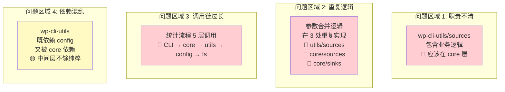
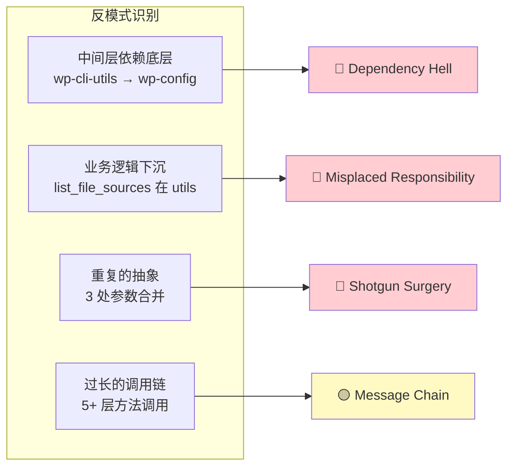
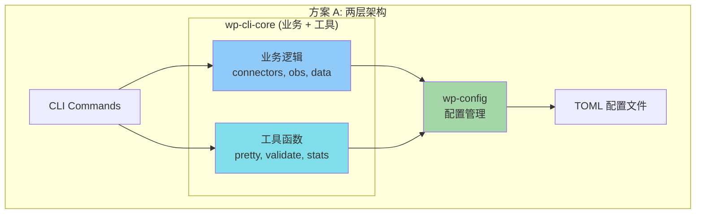
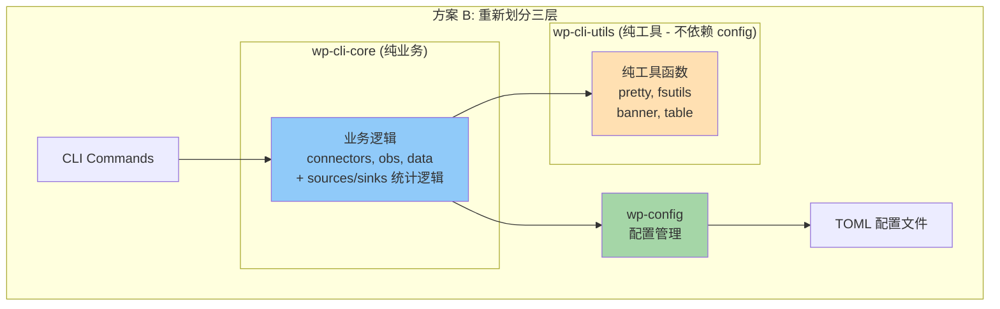
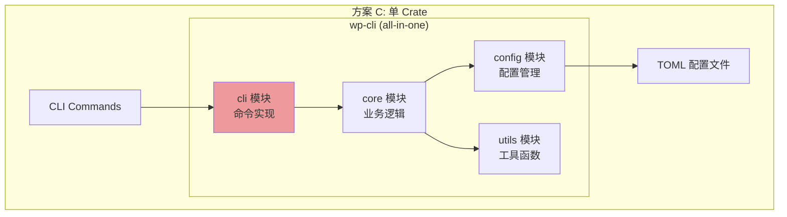
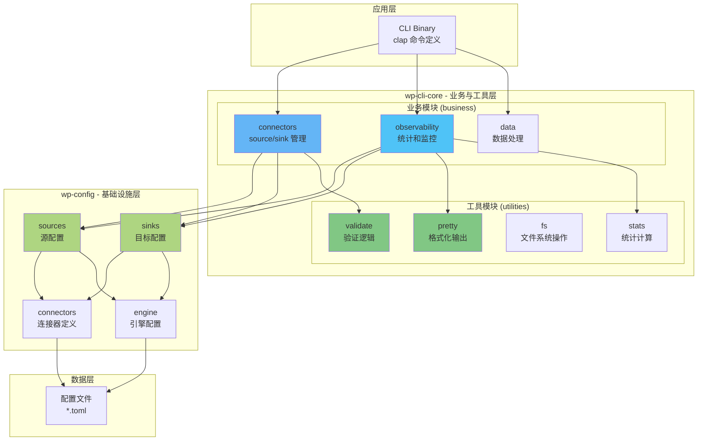
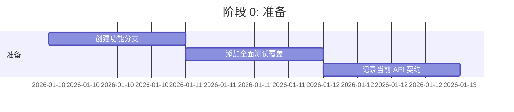
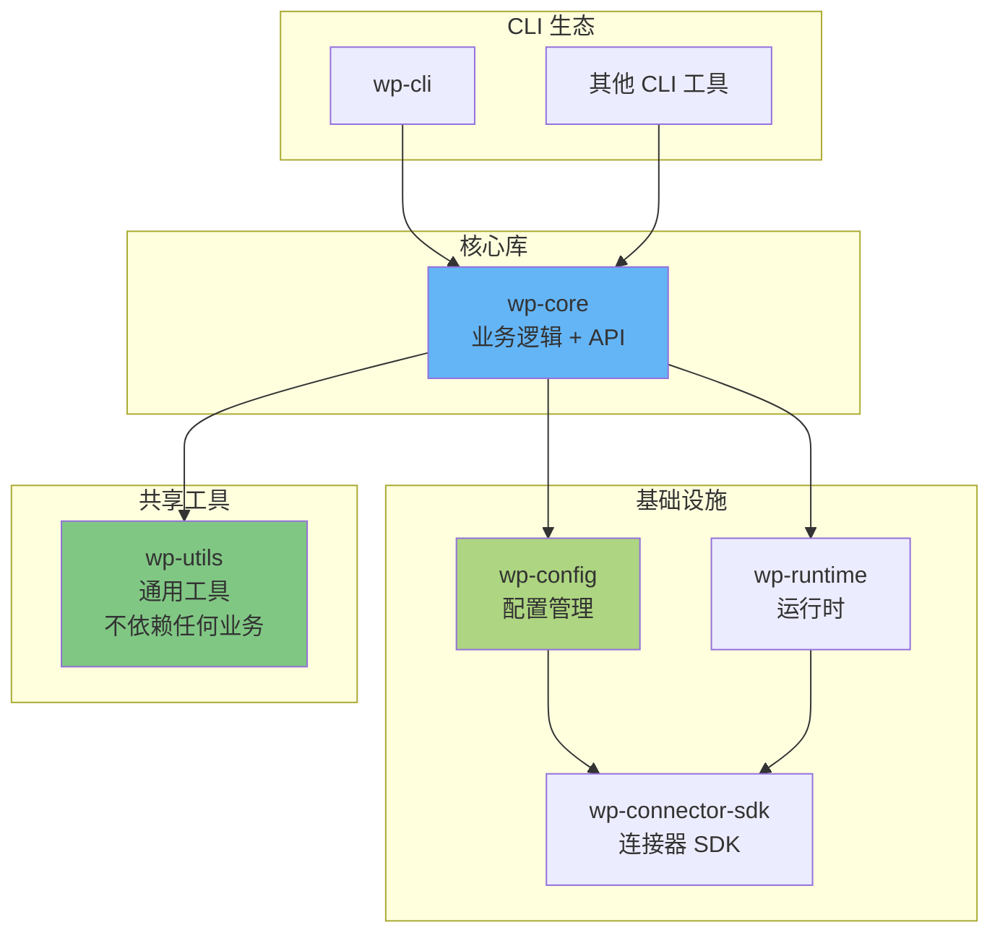

# CLI 架构简化重构方案

> 基于当前三层架构的复杂性分析和简化建议

## 目录

- [1. 当前架构问题分析](#1-当前架构问题分析)
- [2. 简化方案对比](#2-简化方案对比)
- [3. 推荐方案详解](#3-推荐方案详解)
- [4. 重构路线图](#4-重构路线图)
- [5. 风险评估](#5-风险评估)

---

## 1. 当前架构问题分析

### 1.1 复杂性热点图



### 1.2 具体问题清单

| 问题类型 | 具体表现 | 影响 | 严重程度 |
|---------|---------|------|---------|
| **职责不清** | `wp-cli-utils/sources.rs` 包含 `list_file_sources_with_lines()` 等业务逻辑 | 业务逻辑下沉到工具层，违反分层原则 | 🔴 高 |
| **重复代码** | 参数合并逻辑在 3 个地方重复：<br/>- `utils/sources::merge_params()`<br/>- `core/sources::merge_params()`<br/>- `config` 内部合并 | 维护成本高，容易不一致 | 🔴 高 |
| **调用链长** | Source 统计: CLI → core::stat → utils::list → config::load → fs::read | 难以理解和调试 | 🟡 中 |
| **依赖复杂** | `wp-cli-utils` 依赖 `wp-config`，导致不是纯工具库 | 限制 utils 的复用性 | 🟡 中 |
| **模块臃肿** | `wp-config` 包含 10+ 模块，职责过多 | 单个 crate 过于复杂 | 🟢 低 |
| **接口冗余** | 多个函数功能重叠，如 `load_connectors_for` vs `load_connector_defs_from_dir` | API 难以选择 | 🟢 低 |

### 1.3 架构异味 (Architecture Smells)



---

## 2. 简化方案对比

### 方案 A: 两层架构 (推荐)

**合并 wp-cli-utils 到其他层**



**优点**:
- ✅ 层次更清晰，只有业务层和基础设施层
- ✅ 消除中间层的依赖困惑
- ✅ 减少调用跳转，提升可读性
- ✅ 统一管理业务逻辑和工具函数

**缺点**:
- ❌ wp-cli-core 会变大（但职责清晰）
- ❌ 需要重构现有代码

### 方案 B: 保持三层但重新划分

**调整职责边界**



**优点**:
- ✅ 工具层变得纯粹（不依赖业务）
- ✅ 三层职责明确
- ✅ utils 可以被其他项目复用

**缺点**:
- ❌ 需要将 `utils/sources` 和 `utils/validate` 移到 core
- ❌ 仍然是三层，复杂度降低有限

### 方案 C: 激进合并 (不推荐)

**合并为单个 crate**



**优点**:
- ✅ 最简单，没有跨 crate 依赖
- ✅ 编译速度可能更快

**缺点**:
- ❌ 失去模块化优势
- ❌ 测试粒度变粗
- ❌ 不利于代码复用
- ❌ 违反单一职责原则

### 方案对比总结

| 维度 | 方案 A (两层) | 方案 B (三层重划分) | 方案 C (单 crate) | 当前架构 |
|------|-------------|------------------|------------------|---------|
| 复杂度 | ⭐⭐ | ⭐⭐⭐ | ⭐ | ⭐⭐⭐⭐ |
| 可维护性 | ⭐⭐⭐⭐ | ⭐⭐⭐⭐ | ⭐⭐ | ⭐⭐⭐ |
| 可测试性 | ⭐⭐⭐⭐ | ⭐⭐⭐⭐⭐ | ⭐⭐⭐ | ⭐⭐⭐ |
| 代码复用 | ⭐⭐⭐ | ⭐⭐⭐⭐⭐ | ⭐ | ⭐⭐⭐ |
| 重构成本 | ⭐⭐⭐ | ⭐⭐⭐⭐ | ⭐⭐ | - |
| **推荐度** | ✅ **推荐** | 🟡 备选 | ❌ 不推荐 | - |

---

## 3. 推荐方案详解 (方案 A)

### 3.1 目标架构



### 3.2 新架构文件结构

```
crates/
├── wp-config/                    # 基础设施层 (保持不变)
│   ├── src/
│   │   ├── sources/             # Source 配置管理
│   │   ├── sinks/               # Sink 配置管理
│   │   ├── connectors/          # Connector 定义
│   │   ├── structure/           # 数据结构
│   │   ├── engine/              # 引擎配置
│   │   └── lib.rs
│   └── Cargo.toml
│
└── wp-cli-core/                  # 业务 + 工具层 (合并后)
    ├── src/
    │   ├── business/            # 业务逻辑模块 (新)
    │   │   ├── connectors/
    │   │   │   ├── sources.rs   # Source connector 管理
    │   │   │   ├── sinks.rs     # Sink connector 管理
    │   │   │   └── mod.rs
    │   │   ├── observability/   # 观察性模块
    │   │   │   ├── stat.rs      # 统计 (从 obs 移动)
    │   │   │   └── mod.rs
    │   │   ├── data/
    │   │   │   ├── clean.rs
    │   │   │   └── mod.rs
    │   │   └── mod.rs
    │   │
    │   ├── utils/               # 工具函数模块 (新)
    │   │   ├── pretty/          # 格式化输出 (从 wp-cli-utils 移动)
    │   │   │   ├── table.rs
    │   │   │   ├── validate.rs
    │   │   │   └── mod.rs
    │   │   ├── validate/        # 验证逻辑 (从 wp-cli-utils 移动)
    │   │   │   ├── groups.rs
    │   │   │   └── mod.rs
    │   │   ├── fs/              # 文件系统 (从 wp-cli-utils 移动)
    │   │   │   ├── path.rs
    │   │   │   ├── count.rs
    │   │   │   └── mod.rs
    │   │   ├── stats/           # 统计计算 (从 wp-cli-utils 移动)
    │   │   │   └── mod.rs
    │   │   ├── banner.rs
    │   │   └── mod.rs
    │   │
    │   └── lib.rs               # 统一导出
    │
    └── Cargo.toml

# wp-cli-utils 删除 ❌
```

### 3.3 模块职责重新定义

| 模块路径 | 职责 | 示例函数 |
|---------|------|---------|
| **wp-cli-core::business::connectors** | Connector 业务逻辑 | `list_connectors()`, `route_table()`, `validate_routes()` |
| **wp-cli-core::business::observability** | 统计和监控业务 | `stat_src_file()`, `stat_sink_file()`, `aggregate_metrics()` |
| **wp-cli-core::utils::pretty** | 格式化输出 | `print_table()`, `format_report()`, `colorize()` |
| **wp-cli-core::utils::validate** | 数据验证逻辑 | `validate_ratio()`, `check_tolerance()` |
| **wp-cli-core::utils::fs** | 文件系统操作 | `count_lines()`, `resolve_path()`, `walk_dir()` |
| **wp-config::sources** | Source 配置加载 | `load_wpsrc()`, `parse_source_connector()` |
| **wp-config::sinks** | Sink 配置加载 | `load_routes()`, `build_sink_instance()` |

### 3.4 关键改进点

#### 改进 1: 统一参数合并逻辑

**当前**: 3 处重复实现
**改进**: 统一到 `wp-config::connectors::merge_params()`

```rust
// wp-config/src/connectors/params.rs (新增)
pub fn merge_params(
    base: &ParamMap,
    overrides: &ParamMap,
    whitelist: &[String],
) -> Result<ParamMap> {
    let mut result = base.clone();
    for (key, value) in overrides {
        if !whitelist.contains(key) {
            return Err(anyhow!("Parameter '{}' not in whitelist", key));
        }
        result.insert(key.clone(), value.clone());
    }
    Ok(result)
}
```

**调用方**: 所有需要合并参数的地方统一调用此函数

#### 改进 2: 缩短调用链

**当前调用链** (5 层):
```
CLI → core::stat → utils::list → config::load → fs::read
```

**优化后** (3 层):
```
CLI → core::stat (直接调用 config + fs)
```

```rust
// wp-cli-core/src/business/observability/stat.rs
pub fn stat_src_file(work_root: &str) -> Result<SrcLineReport> {
    // 直接调用 config 层
    let config = wp_config::sources::load_wpsrc(work_root)?;
    let connectors = wp_config::connectors::load_all(work_root)?;

    // 直接调用 fs 工具
    let mut items = Vec::new();
    for src in config.sources {
        let params = wp_config::connectors::merge_params(
            &connectors[&src.connect].params,
            &src.params_override,
            &connectors[&src.connect].allow_override,
        )?;

        let path = resolve_file_path(&params)?;
        let lines = crate::utils::fs::count_lines(&path)?;
        items.push(SrcLineItem { ... });
    }

    Ok(SrcLineReport { items })
}
```

#### 改进 3: 清晰的模块导出

```rust
// wp-cli-core/src/lib.rs
pub mod business {
    pub mod connectors;
    pub mod observability;
    pub mod data;
}

pub mod utils {
    pub mod pretty;
    pub mod validate;
    pub mod fs;
    pub mod stats;
}

// 便捷重导出
pub use business::connectors::{list_source_connectors, list_sink_connectors};
pub use business::observability::{stat_src_file, stat_sink_file};
```

---

## 4. 重构路线图

### 阶段 0: 准备工作 (1 天)



**任务清单**:
- [ ] 创建 `refactor/two-layer-arch` 分支
- [ ] 为现有功能补充集成测试（确保重构后不破坏功能）
- [ ] 列出所有公共 API，标记哪些需要保持兼容
- [ ] 备份当前代码

### 阶段 1: 创建新结构 (2 天)

**任务清单**:
- [ ] 在 `wp-cli-core` 中创建 `business/` 和 `utils/` 目录
- [ ] 将 `wp-cli-utils` 的文件复制到 `wp-cli-core/src/utils/`
  - `pretty/` → `utils/pretty/`
  - `fsutils.rs` → `utils/fs/mod.rs`
  - `validate.rs` → `utils/validate/mod.rs`
  - `stats.rs` → `utils/stats/mod.rs`
  - `banner.rs` → `utils/banner.rs`
- [ ] 将当前 `wp-cli-core/src/obs/` 移动到 `business/observability/`
- [ ] 将当前 `wp-cli-core/src/connectors/` 移动到 `business/connectors/`

### 阶段 2: 统一参数合并 (1 天)

**任务清单**:
- [ ] 在 `wp-config/src/connectors/` 创建 `params.rs`
- [ ] 实现统一的 `merge_params()` 函数
- [ ] 替换所有使用点：
  - `wp-cli-core/business/connectors/sources.rs`
  - `wp-cli-core/business/connectors/sinks.rs`
  - `wp-cli-core/business/observability/stat.rs`
- [ ] 运行测试确保行为一致

### 阶段 3: 简化调用链 (2 天)

**任务清单**:
- [ ] 重写 `stat_src_file()` 减少中间层
- [ ] 重写 `stat_sink_file()` 减少中间层
- [ ] 移除不必要的包装函数
- [ ] 更新所有调用点
- [ ] 运行集成测试

### 阶段 4: 更新导出和依赖 (1 天)

**任务清单**:
- [ ] 更新 `wp-cli-core/src/lib.rs` 的模块导出
- [ ] 更新 `wp-cli-core/Cargo.toml`，移除对 `wp-cli-utils` 的依赖
- [ ] 更新所有 `use` 语句，改为新的模块路径
- [ ] 确保编译通过

### 阶段 5: 删除旧 crate 和清理 (1 天)

**任务清单**:
- [ ] 删除 `crates/wp-cli-utils/` 目录
- [ ] 更新 workspace `Cargo.toml`，移除 `wp-cli-utils`
- [ ] 更新文档和 README
- [ ] 运行全量测试套件
- [ ] 修复所有编译警告

### 阶段 6: 验证和优化 (1 天)

**任务清单**:
- [ ] 运行性能基准测试对比
- [ ] 检查编译时间变化
- [ ] 代码审查
- [ ] 更新架构文档
- [ ] 合并到主分支

### 总时间估算

```
准备:     1 天
重构:     7 天
验证:     1 天
总计:     9 天 (约 2 个工作周)
```

---

## 5. 风险评估

### 5.1 风险矩阵

| 风险 | 概率 | 影响 | 优先级 | 缓解措施 |
|------|------|------|--------|---------|
| 破坏现有功能 | 🟡 中 | 🔴 高 | **P1** | 充分的测试覆盖；功能分支开发 |
| 编译时间增加 | 🟢 低 | 🟡 中 | P3 | 监控编译时间；考虑拆分大模块 |
| 依赖冲突 | 🟢 低 | 🟢 低 | P4 | 仔细审查 Cargo.toml |
| API 变更影响下游 | 🟡 中 | 🟡 中 | P2 | 保持公共 API 兼容性 |
| 开发时间超期 | 🟡 中 | 🟡 中 | P2 | 分阶段发布；每阶段验证 |

### 5.2 回滚计划

如果重构失败，回滚步骤：

```bash
# 1. 切回主分支
git checkout main

# 2. 删除重构分支
git branch -D refactor/two-layer-arch

# 3. 恢复备份（如果已合并）
git revert <merge-commit>

# 4. 重新发布旧版本
cargo publish --package wp-cli-utils
cargo publish --package wp-cli-core
```

### 5.3 成功指标

重构成功的标准：

- [ ] 所有现有测试通过
- [ ] 代码覆盖率不降低
- [ ] 编译时间不增加超过 10%
- [ ] 调用链深度减少至少 30%
- [ ] 代码重复率降低至少 50%
- [ ] 团队 Code Review 通过

---

## 6. 替代方案 B 详解 (备选)

如果方案 A 风险太大，可以考虑渐进式的方案 B。

### 6.1 渐进式重构

**第一步**: 让 `wp-cli-utils` 不再依赖 `wp-config`

```rust
// wp-cli-utils 只保留纯工具函数
pub mod pretty;    // ✅ 保留 - 格式化输出
pub mod fs;        // ✅ 保留 - 文件系统操作
pub mod banner;    // ✅ 保留 - Banner 显示

// ❌ 移除 - 移到 wp-cli-core
// pub mod sources;   → 移到 core::business::sources
// pub mod validate;  → 移到 core::business::validate
// pub mod stats;     → 移到 core::business::stats
```

**第二步**: 将业务逻辑上移到 `wp-cli-core`

```
wp-cli-core/src/
├── business/
│   ├── sources/      # 从 utils/sources 移动
│   ├── validate/     # 从 utils/validate 移动
│   └── stats/        # 从 utils/stats 移动
```

**第三步**: 评估是否需要保留 `wp-cli-utils`

如果 `wp-cli-utils` 只剩下几个函数，可以考虑最终合并。

---

## 7. 长期架构愿景

### 7.1 理想的最终状态



**核心原则**:
1. **wp-utils**: 完全独立，可被任何项目使用
2. **wp-config**: 只负责配置管理，不包含业务逻辑
3. **wp-core**: 包含所有业务逻辑和 API
4. **CLI**: 薄层，只负责参数解析和调用 core

---

## 8. 实施建议

### 优先级排序

| 优先级 | 行动项 | 收益 | 成本 |
|-------|--------|------|------|
| **P0** | 统一参数合并逻辑 | 🟢🟢🟢 高 | 🟢 低 |
| **P0** | 移除 `utils/sources` 中的业务逻辑 | 🟢🟢🟢 高 | 🟡 中 |
| **P1** | 缩短调用链（stat 相关） | 🟢🟢 中 | 🟡 中 |
| **P2** | 合并 crates (两层架构) | 🟢🟢🟢 高 | 🔴 高 |
| **P3** | 清理冗余接口 | 🟢 低 | 🟢 低 |

### 推荐实施路径

**保守路径** (降低风险):
1. 先做 P0 项目（2-3 天）
2. 观察效果，验证改进
3. 再考虑 P1、P2 项目

**激进路径** (快速重构):
1. 直接执行方案 A 的完整重构
2. 在 2 周内完成所有改进
3. 一次性解决所有架构问题

**折中路径** (推荐):
1. Week 1: 执行 P0 项目
2. Week 2: 执行 P1 项目
3. Week 3-4: 评估后决定是否执行 P2

---

## 附录: 代码示例对比

### 当前架构示例

```rust
// 调用链: CLI → core → utils → config → fs (5 层)

// 1. CLI 调用
let report = wp_cli_core::obs::stat::stat_src_file(work_root, &eng_conf)?;

// 2. core 层
pub fn stat_src_file(work_root: &str, eng: &EngineConfig) -> Result<Option<SrcLineReport>> {
    let ctx = wpcnt_lib::types::Ctx::new(work_root.to_string());
    Ok(wpcnt_lib::list_file_sources_with_lines(Path::new(work_root), eng, &ctx))
}

// 3. utils 层
pub fn list_file_sources_with_lines(...) -> Option<SrcLineReport> {
    let content = read_wpsrc_toml(work_root, eng_conf)?;
    let conn_map = load_connectors_map(&conn_dir)?;
    for item in sources {
        let merged = merge_params(...);  // 第 1 处参数合并
        let lines = count_lines_file(&path)?;
    }
}

// 4. config 层
pub fn load_connectors_map(...) -> Option<BTreeMap<...>> {
    wp_conf::sources::load_connectors_for(base_dir, &EnvDict::default())
}
```

### 重构后示例

```rust
// 调用链: CLI → core (直接调用 config + fs) (2 层)

// 1. CLI 调用
let report = wp_cli_core::business::stat_src_file(work_root)?;

// 2. core 层 (直接调用底层)
pub fn stat_src_file(work_root: &str) -> Result<SrcLineReport> {
    // 直接加载配置
    let wpsrc_path = wp_config::engine::resolve_wpsrc_path(work_root)?;
    let config = wp_config::sources::load_wpsrc(&wpsrc_path)?;
    let connectors = wp_config::connectors::load_source_connectors(work_root)?;

    let mut items = Vec::new();
    for src in config.sources {
        // 统一的参数合并
        let params = wp_config::connectors::merge_params(
            &connectors[&src.connect].default_params,
            &src.params_override,
            &connectors[&src.connect].allow_override,
        )?;

        // 直接调用 fs 工具
        let path = crate::utils::fs::resolve_path(&params["path"], work_root)?;
        let lines = crate::utils::fs::count_lines(&path)?;

        items.push(SrcLineItem { key: src.key, lines, ... });
    }

    Ok(SrcLineReport { items, total: items.iter().map(|i| i.lines).sum() })
}
```

**改进对比**:
- 调用层次: 5 层 → 2 层 ✅
- 代码行数: ~80 行 → ~30 行 ✅
- 参数合并: 3 处重复 → 1 处统一 ✅
- 可读性: 需跳转多个文件 → 单文件可读 ✅

---

**文档版本**: 1.0
**创建日期**: 2026-01-10
**作者**: Architecture Review Team
**状态**: 待评审
